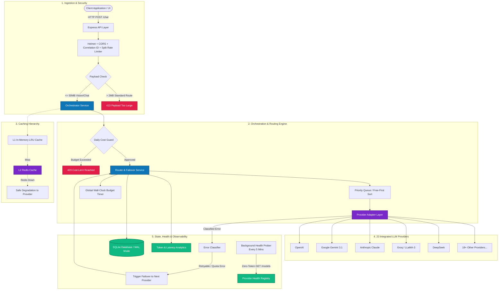

<div align="center">

# ⚡ AI Gateway
### High-Resilience Multi-LLM Router & Failover Engine

[](https://www.typescriptlang.org/)
[](https://nodejs.org/)
[](https://expressjs.com/)
[](https://www.docker.com/)
[](https://sqlite.org/)
[](https://redis.io/)
[](https://jestjs.io/)
[](#supported-providers)

<br/>

**[🌐 Live Dashboard](https://ai-gateway-alpha.vercel.app/)** • **[🚀 Backend API](https://ai-gateway-wx35.onrender.com)** • **[📖 API Documentation](#api-endpoints)** • **[🐳 Docker Guide](#docker)**

<br/>

<p align="center">
  <b>A production-grade LLM orchestration gateway exposing a unified OpenAI-compatible Chat API in front of 23 providers.</b><br/>
  Engineered with task-aware routing, automated error-classified failover, dual-tier caching (L1 Memory + L2 Redis),<br/>
  zero-token active health probing, token spend guardrails, and persistent conversation context.
</p>

</div>

---

## 📑 Table of Contents

- [Key Engineering Highlights](#-key-engineering-highlights)
- [System Architecture](#-system-architecture)
- [Deep-Dive: Core Architectural Decisions](#-deep-dive-core-architectural-decisions)
- [Supported Providers (23 Adapters)](#-supported-providers)
- [Free-First vs. Paid Routing Engine](#-free-first-vs-paid-routing-engine)
- [Active Health Probing & Observability](#-active-health-probing--observability)
- [API Reference & Usage](#-api-reference--usage)
- [Production Hardening Checklist](#-production-hardening-checklist)
- [Quick Start](#-quick-start)
- [Docker Deployment](#-docker-deployment)
- [Environment Configuration](#-environment-configuration)
- [Project Layout & Source of Truth](#-project-layout--source-of-truth)

---

## 🌟 Key Engineering Highlights

- **Unified Provider Abstraction:** One standard Chat Completions contract decoupling applications from 23 individual vendor SDKs and breaking API changes.
- **Intelligent Error-Classified Failover:** Distinguishes between retryable transient network spikes and permanent auth/quota failures, switching to the next optimal provider with zero human intervention.
- **Free-First Economic Optimization:** Defaults to zero-billing-risk providers (Groq, Cerebras, Gemini 3.1 Flash Lite, Cloudflare, etc.) with opt-in fallback to cheapest-per-token paid tiers (`freeOnly: false`).
- **Strict Wall-Clock Request Budget:** Enforces a global deadline (e.g. 60s) across the entire failover chain, preventing cascading retry storms from hanging client connections.
- **Zero-Token Background Health Probing:** Automatically audits provider liveness every 5 minutes via metadata endpoints (`GET /models`), keeping latency and health data fresh without token costs.
- **Dual-Tier L1/L2 Caching:** In-memory LRU cache backed by optional Redis L2; designed with **graceful degradation** so Redis outages never take down the gateway.
- **High-Throughput Vision Support:** Dedicated 50 MB parser for `/chat` and `/chat/stream` accommodating high-resolution base64 multimodal payloads while enforcing strict 2 MB limits on standard REST routes.
- **Complete Session & Project Persistence:** Fully persistent conversation state, workspace files, undo history, and snapshots stored in SQLite.

---

## 🏛️ System Architecture



---

## 🔍 Deep-Dive: Core Architectural Decisions

### 1. Why SQLite with WAL Mode for State Persistence?
- **Zero-Dependency Footprint:** Eliminates the operational overhead and network latency of external database clusters for standalone or edge deployments.
- **Embedded ACID Performance:** By enabling **Write-Ahead Logging (WAL)** mode, SQLite allows concurrent readers alongside a writer, easily handling thousands of session events per minute with sub-millisecond local queries.
- **Data Locality:** Conversation histories and session undo logs are co-located on the same disk, ensuring fast conversation context reconstruction before routing.

### 2. The Cascading Failover Problem & Global Request Budget
- **The Problem:** In a system with 23 providers, if an outage occurs and each provider times out after 30s with 2 retries, a client request could hang for **10+ minutes** before returning a failure.
- **The Architecture:** AI Gateway enforces a **Global Request Budget** (`GATEWAY_REQUEST_BUDGET_MS=60000`). Regardless of where the router is in its failover sequence, if the total elapsed wall-clock time hits the budget ceiling, the sequence safely terminates and returns a coherent degraded response or classified error.

### 3. Error Classification: Retry vs. Failover Logic
Not all HTTP errors are created equal. The router employs strict error categorization:
- **Provider-Fatal (Immediate Failover):** `401 Unauthorized` (bad API key), `402 Payment Required` (depleted balance), `404 Model Not Found`. The gateway *never* retries these against the same provider; it immediately rotates to the next provider in the chain and marks the failed provider as `auth_error` or `billing_required`.
- **Transient (Retryable within Provider):** `429 Rate Limited`, `500/503 Service Unavailable`, Socket Hangup. The gateway performs exponential backoff retries up to `MAX_RETRIES` before failing over.

### 4. Zero-Downtime Cache Degradation (L1 -> L2)
- Responses are checked first in local process memory (L1).
- On miss, the gateway queries Redis (L2) for shared cross-instance hits.
- **Fault-Tolerant Design:** If Redis disconnects or times out, the gateway logs a warning and treats it strictly as a cache miss—**the client request is never dropped due to cache infrastructure failures**.

---

## 🌐 Supported Providers

The gateway includes **23 integrated provider adapters** maintained under `src/providers/`:

| Category | Providers |
|---|---|
| **Frontier & Proprietary** | OpenAI, Google Gemini, Anthropic Claude, Mistral AI, Kimi / Moonshot AI |
| **High-Throughput Inference** | Groq, Cerebras, SambaNova Cloud, Together AI, Fireworks AI, DeepSeek, Novita AI, Nebius AI |
| **Serverless & Edge AI** | Cloudflare Workers AI, Baseten, ModelScope, Inference.net, NVIDIA NIM, AI/ML API |
| **Aggregators & Free Quotas** | OpenRouter, Hugging Face, Cohere, GitHub Models |

> **Google Gemini Free Tier Note:** Powered by the OpenAI-compatible endpoint at `https://generativelanguage.googleapis.com/v1beta/openai`. Default model is **`gemini-3.1-flash-lite`** (free-tier GA model optimized for high-volume, low-latency reasoning).

---

## 💰 Free-First vs. Paid Routing Engine

By default, the gateway guarantees **zero billing risk** by restricting automatic routing to completely free/free-tier providers.

To allow the gateway to fall back to paid providers when all free providers are saturated, clients can opt-in on a per-request basis:

```json
{
  "messages": [
    { "role": "user", "content": "Analyze this system architecture." }
  ],
  "freeOnly": false
}
```

- **Execution Order:** Free providers are always attempted first. If and only if all free providers are exhausted or degraded, paid providers are attempted in **cheapest-per-token order**.
- **Provider Pinning:** `forceProvider: "anthropic"` bypasses automatic routing and strictly pins the designated adapter.

---

## 🩺 Active Health Probing & Observability

Unlike passive gateways that only know a provider is down when a user experiences an error, AI Gateway runs an **Active Background Prober** (`src/services/health-check.service.ts`):

- **Startup + Every 5 Minutes:** Executes zero-token `GET /models` discovery queries across configured keys.
- **Real-Time Traffic Sync:** Live chat requests continuously update provider states. If traffic already verified a provider recently, the prober skips redundant checks.
- **9 Granular Health States:**
  `configured` • `healthy` • `degraded` • `rate_limited` • `auth_error` • `model_unavailable` • `billing_required` • `retired` • `unknown`
- **End-to-End Tracing:** Every HTTP request is tagged with an `X-Request-ID` correlation UUID, propagated across Winston logs, router attempts, and error stacks.

---

## 📡 API Reference & Usage

### 1. Standard Chat Completion
`POST /chat`

```bash
curl -X POST http://localhost:4000/chat \
  -H "Content-Type: application/json" \
  -d '{
    "messages": [
      { "role": "user", "content": "Explain how distributed failover works." }
    ],
    "taskType": "reasoning",
    "freeOnly": true
  }'
```

### 2. Streaming Chat Completion (SSE)
`POST /chat/stream`

```bash
curl -N -X POST http://localhost:4000/chat/stream \
  -H "Content-Type: application/json" \
  -d '{
    "messages": [
      { "role": "user", "content": "Write a TypeScript function to debounce an API call." }
    ]
  }'
```

### 3. Multimodal Vision Request
The router dynamically filters and routes vision requests exclusively to vision-capable models (e.g. Gemini 3.1, Claude 3.5, GPT-4o):

```json
{
  "messages": [
    {
      "role": "user",
      "content": "Analyze this architecture diagram.",
      "images": [
        {
          "mimeType": "image/png",
          "base64": "iVBORw0KGgoAAAANSUhEUgAA..."
        }
      ]
    }
  ]
}
```

### 4. Health & System Discovery
| Endpoint | Method | Description |
|---|:---:|---|
| `/health` | `GET` | Returns 9-state health status and latency for all configured providers |
| `/health/models` | `GET` | Validates live model availability across active adapters |
| `/providers` | `GET` | Lists available providers with free vs. paid model categorization |
| `/analytics` | `GET` | Aggregated latency, token counts, error rates, and failover frequency |

---

## 🛡️ Production Hardening Checklist

- [x] **Global Wall-Clock Deadline:** Hard cap across multi-hop failovers (`GATEWAY_REQUEST_BUDGET_MS`).
- [x] **No-Dead-End Heuristic:** If all providers enter temporary cooldown, probes continue rather than failing synthetically.
- [x] **Rolling 24-Hour Cost Guard:** Automatic HTTP 429 shutoff when daily spend limit (`DAILY_COST_BUDGET_USD`) is exceeded.
- [x] **Split Rate Limiting:** Generous limits on read/health endpoints; strict quotas on inference paths.
- [x] **Dual JSON Body Parsers:** 2 MB default parser for general routes; 50 MB dedicated parser for image/vision payloads.
- [x] **Graceful Process Shutdown:** Handles `SIGTERM`/`SIGINT` by stopping new connections, draining inflight requests, flushing Redis buffers, and closing SQLite safely.
- [x] **Structured Cloud Observability:** Direct stdout JSON logging for seamless Datadog/CloudWatch/Render ingestion.

---

## 🚀 Quick Start

### Prerequisites
- Node.js 20+
- npm or pnpm

```bash
# 1. Clone the repository
git clone https://github.com/rahulxgit/ai-gateway.git
cd ai-gateway

# 2. Install dependencies
npm install

# 3. Configure environment
cp .env.example .env
# Open .env and add at least one provider key (e.g. GEMINI_API_KEY)

# 4. Initialize database
npm run migrate

# 5. Start development server
npm run dev
```
The server will start at `http://localhost:4000`.

---

## 🐳 Docker Deployment

Run the complete gateway stack (including Redis caching) with a single command:

```bash
cp .env.example .env
docker compose up --build -d
```

To run in lightweight mode without Redis:
```bash
CACHE_ENABLED=false docker compose up --build -d
```

---

## ⚙️ Environment Configuration

Key configuration parameters from `.env.example`:

| Variable | Default | Description |
|---|:---:|---|
| `PORT` | `4000` | HTTP port for gateway server |
| `DATABASE_URL` | `./data/gateway.db` | Local SQLite database file location |
| `REQUEST_TIMEOUT_MS` | `30000` | Timeout per individual provider attempt |
| `GATEWAY_REQUEST_BUDGET_MS` | `60000` | Total wall-clock ceiling across full failover sequence |
| `MAX_RETRIES` | `2` | Max retry attempts for transient errors |
| `DAILY_COST_BUDGET_USD` | `0` | Daily spend limit in USD (`0` = disabled) |
| `CACHE_ENABLED` | `false` | Enable Redis L2 caching |
| `REDIS_URL` | `redis://localhost:6379` | Connection string for Redis |
| `LOG_LEVEL` | `info` | Winston logging level (`debug`, `info`, `warn`, `error`) |

---

## 📂 Project Layout & Source of Truth

```text
src/
├── config/                 # Environment variables and routing tier configs
│   ├── env.ts              # Validated environment loader
│   └── routing.ts          # Free/paid provider precedence orders
├── providers/              # 23 Modular provider adapters
│   ├── registry.ts         # Central provider factory and registration
│   └── adapters/           # Individual vendor transport logic
├── services/               # Core business logic
│   ├── router.service.ts   # Failover engine, retries, and deadline enforcement
│   ├── orchestrator.service.ts # Request lifecycle & cost guard
│   ├── health.service.ts   # Health state registry & evaluation
│   ├── health-check.service.ts # Background zero-token active prober
│   └── analytics.service.ts# Usage, latency, and spend metrics
├── middleware/             # Rate limiting, validation, and request tracing
├── database/               # SQLite client, schemas, and migrations
└── utils/                  # Redis cache, logger, and graceful shutdown handlers
```

---

## 🧪 Testing & Verification

```bash
# Run unit & integration test suites
npm test

# Type-check TypeScript without emitting
npx tsc --noEmit

# Lint code style
npm run lint

# Build production bundle
npm run build
```

---

<div align="center">
  <b>Engineered by Rahul Kumar</b><br/>
  <i>Full-Stack & AI Engineer • B.Tech Graduate from NIT Raipur</i><br/>
  <a href="https://www.linkedin.com/in/rahulxnit/">LinkedIn</a> • <a href="https://github.com/rahulxgit">GitHub</a> • <a href="mailto:rahulkumarshc00@gmail.com">Email</a>
</div>
